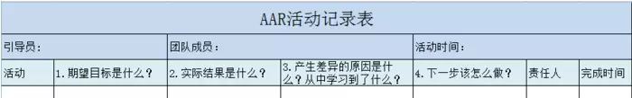

## AAR（事后回顾）--来自美国陆军的分析法

第一次接触AAR这个词是在我毕业后刚进入项目组的时候，那时候的项目上线成功后，总会进行一轮AAR会议。当时的我不是太明白AAR是什么？不过，每次接触到一个新生事物，我总是希望可以尽可能的去搞清楚，然后通过自己的话再陈述出来，这样，知识就是你的了。
所谓的AAR称之为事后评估（After Action Review），具体的可以自己百度一下，它来自于美国陆军的一套标准操作程序，它是一种方法，一种工具，一种手段，AAR可以让参与成员及时回顾过程中的收获，不论是好与不好的经验。
西点军校有人说，过去25年里，AAR已经彻底改变了整个陆军。

“行动后点评”的意思是说，不管是在训练结束之后，还是在真正的战斗之后，所有士兵和军官要一起讨论这次行动的得失。不看职位高低，每个人必须畅所欲言，比如说下级要直言不讳地给上级指出错误，告诉他哪个地方指挥错了。
这不就是即时反馈吗？这不就是最近十几年心理学流行的“刻意练习”概念吗？美军这个“群众路线”，是付出了重大的代价才学会的——而且把它发挥到了极致。
AAR最早起源于越南战争。第二次世界大战和朝鲜战争中美国空军优势都很强，空战交换比能达到5∶1，甚至有时候是10∶1，也就是打掉对方五到十架飞机，自己才损失一架。可是在越南战争期间，美军的F-4明明比越军使用的米格-21性能好，可是交换比居然只有2.3∶1。由于无法承受这样的损失，美军在优势的情况下居然被打怕了，干脆在1968年把空战停止了一整年。
在没有空战的这一年期间，海军想了一个新办法去训练飞行员，而空军并没有采用这个新办法。过去旧的训练方法是F-4飞行员对抗F-4飞行员，这两个飞行员的思路都是一样的，没有针对性，他们不知道米格飞行员怎么想。

而海军的这个新方法有三个原则。

**第一，一切动作和结果都要记录在案。**

**第二，训练中的假想敌——蓝军——得有针对性，越真实越好，最好还要让蓝军比红军更厉害。**

**第三，必须进行行动后点评。**

点评中每个动作都可能受到质疑：当时为什么要做这个动作，你在想什么，如果换个做法会怎么样。结果一年后重新开始空战，海军的空战交换比从2.4提升到了12.5。空军坚持旧的训练法，他们的交换比从2.3降低到了2.0。
从此之后，这个训练方法向美国全军推广，陆军也开始学习，而且学得很好。现在美军各个训练营地采用最真实的方法模拟敌情，AAR得到了彻底的执行。海军最早使用AAR的训练基地还被拍了电影，这就是著名的Top Gun（《壮志凌云》）。

**AAR的基本流程：**

AAR的操作流程时间不宜过长，15分钟~2小时之内完成。

**1.期望目标是什么?**

期望的目标应是不可量化的，例如，版本开发完成，版本顺利转测等等（避免使用量化词）

**2.实际结果是什么?**

需要引导员，这一步仅仅只是讨论结果是什么，输出实际结果情况，结果也需要具体可量化的数据。

**3.产生差异的原因是什么？从中学习到了什么？**

这是最关键的一步，方法可使用5W+1H等方式去查找根因，找出实际结果与期望结果产生偏差的原因，通常前两个问题占用25%的时间，这个问题需要50%的时间。

**4.下次我们该怎么做?**

总结的经验需要SMART化，避免类似下次注意不迟到等事项说明，这种事项无法衡量，任务需要SMART化，目标明确、可完成、有具体时间等；另外分析的任务结果不应太少也不需要太多，抓住问题的80%的动作才是。

**AAR的操作方法:**

**1、做好AAR 的七个原则**

只有评估之后，工作才算完成

尽快实施评估

确保完全参与

营造畅所欲言的氛围

使用标准程序

记录经验教训

传播经验教训

**2、AAR的基本程序**

A.我们打算做什么?

B.实际发生了什么?

C.成功之处是什么？不足之处是什么？有什么改进或创新的机会？

D.下次我们将怎么做?

**实施AAR的障碍:**

实践证明，AAR是一个容易掌握且行之有效的方法。但是，许多组织却很少做AAR，主要原因有以下三点：

1、嫌麻烦，认为是浪费时间。

2、怕暴露问题，怕丢面子。

3、组织缺少持续改进的文化。

**那么，什么主题可以做AAR？**

	AAR可以说基本不限制主题，任何活动都可以使用该AAR进行总结，比如团队进行的版本转测试工作、代码架构质量提升工作都可作为AAR主题来进行，过程中无需带有追责，谴责的态度，更对的是回归经验，总结经验，及在未来避免发生不好的地方，优化好的地方。 以上基本就是AAR的大致流程，在工作中的使用可以避免发生相同的错误，优化改进目前的流程，所有的方法刚开始都是不适应的，唯有完成先僵化，再固话，最后优化的过程，才能融会贯通。