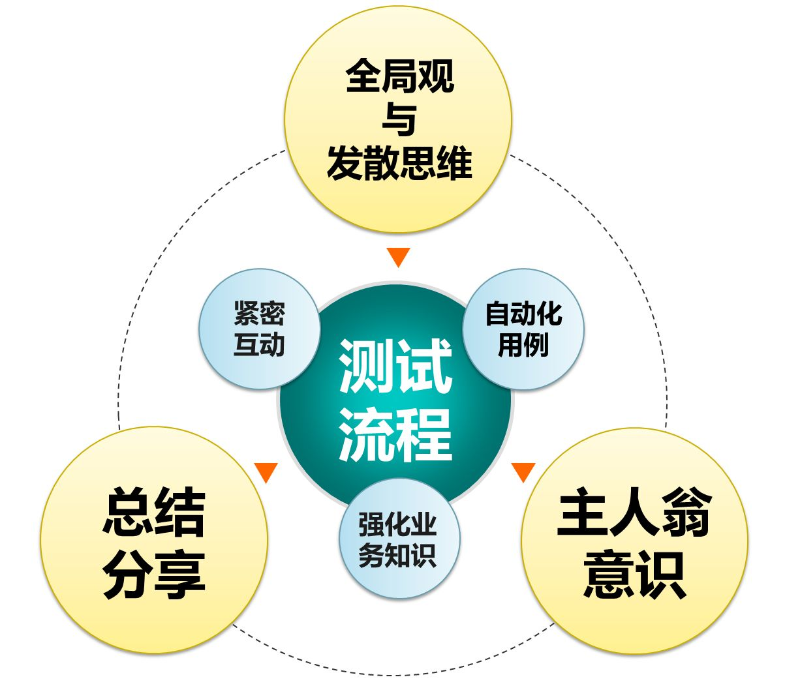
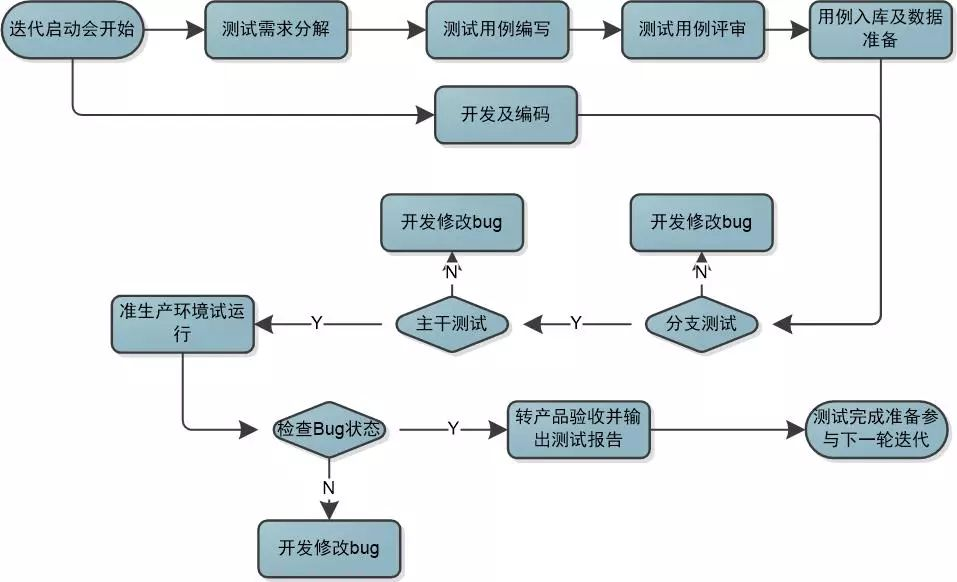

# 流程化

QS项目组采用的是迭代开发模式，每个迭代大约2周或3周，结合软件质量室制定的测试流程，以及以往的测试经验，按固定的测试流程模式和套路去操作，这样既能保证测试工作有条不紊的进行、避免疏漏，又保证了各阶段测试的产出物，使测试工作标准化。

（编码完成的需求，是一个一个转测试的，那么在进行分支测试的同时，其实是会有其他的开发任务在并行处理，并不是传统意义上瀑布模式的“先开发后测试”）

# 紧密互动
测试和开发是密不可分的两部分，除了在正常的测试进度中要保持紧密的沟通互动以外，还有三个方面需要注意：

# 参与迭代需求讲解会
测试人员尽早的参与到项目里，尽早的了解需求。
在QS项目中，项目经理在迭代启动会上进行需求讲解，测试人员可以了解需求的设计，也可以参与到设计中去。

# 测试用例评审
这个环节一般在迭代需求讲解会之后的3到5天进行比较好，这时开发人员对需求已基本理解清楚，可以对测试用例的完整性提出很好的意见。
利用思维导图做好测试用例的整体思路，在评审会上针对每一条需求进行用例说明，开发成员进行确认。
这种面对面的评审方式能很好的提高用例的有效性及全面性，对于保证测试质量起到了至关重要的作用。

# 快速响应
在能保证测试质量的前提下，肯定是测试的越快越好，所以测试人员在开发转测前要做好测试的准备工作。同时，项目经理对于开发人员提出加强自测、每个迭代按功能拉分支等方法，来提高项目的质量，加快项目的完工时间。

# 自动化用例
自动化用例的维护是一项长期的工作，需要每天去关注，定期去更新，才能达到好的效果。现在QS系统在上线前可以通过执行自动化测试用例，来确认更新内容是否对其它功能有影响。
截止到目前，QS系统已经运行两年多，关键算法和流程的自动化用例总计有600多条，每天对自动化执行结果进行检查，确保每日自动化结果100%成功，自动化平台已成为QS系统质量保证的重要角色。

# 维护原有用例
保证自动化数据的正确性。

# 及时更新用例
检查每天的自动化执行结果，及时发现、分析、解决失败用例的问题。
保证自动化数据的完整性。
每个迭代完成后整理和更新，把新增功能同步增加到自动化用例中。

# 强化业务知识

测试人员是介于开发人员和业务人员之间的一个角色，测试人员需要从产品功能的实用性、易用性等方面来验证是否满足业务需要，自然离不开业务知识，只有不断学习项目本身业务知识，才能在用例编写、测试执行、整体项目的把控上做到位。
多了解业务的一些知识并学会用专业术语，比如本行业的专业术语、行业标准、或者发布的一些文档及报表等，也可以使自己向专业化迈近。

# 善于记录总结与分享

在工作中要时刻保持“记录总结”的习惯，把测试过程中学习到的功能、业务知识或比较好的SQL语句记录下来，定期总结测试过程中遇到的问题，多想想为什么，同时也会把类似的知识或者经验教训分享给其他小伙伴们。
在这种情况下，不仅仅大大提高了我们的工作效率，也保证了我们在工作中能跟开发组的队友们站在同一高度看问题，避免了经常去问开发队友们问题，而造成对彼此工作效率的影响。

# 全局观与发散思维

以测试YL96价改项目为例，在此之前，对全局观的认识还不够。针对价改文件的测试，数据量、资金额都比较大的情况，借鉴了运营对账方式，即从总账入手的方式进行测试，如果总账核对有误，那说明资金肯定是有问题的。这种从总体到细节的方式，测试方法上也可以借鉴一下。
发散思维是编写测试用例的基本功，单纯从需求上是很难做出一套全面的测试用例。需要自己根据需求点、功能、再结合业务、系统流程去系统的展开思维，才能做到用例的全面性。

# 主人翁意识

也就是责任感，时刻把自己做为项目主人，为项目的质量把好关，注意细节，不轻易放过不理解的地方，以“怎样才能更好，怎样才能更快”的标准处理每一个工作细节，我们的团队才能越来越好。

以上的总结，仅仅是小熊在本公司本项目组得出来的“最合适套路”，可能并不适用于其他公司的一些项目组，那么亲爱的小伙伴们，你们有没有更好的经验，或者觉得小熊还有什么没有考虑到的呢？